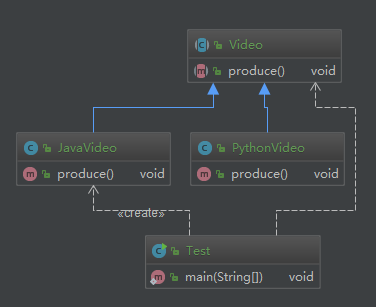
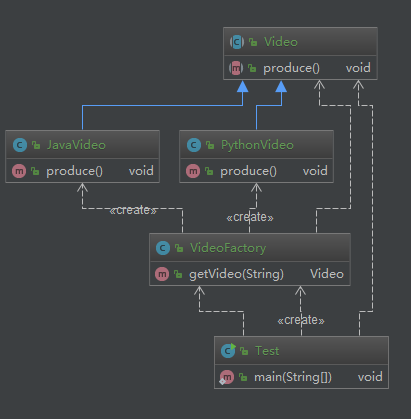
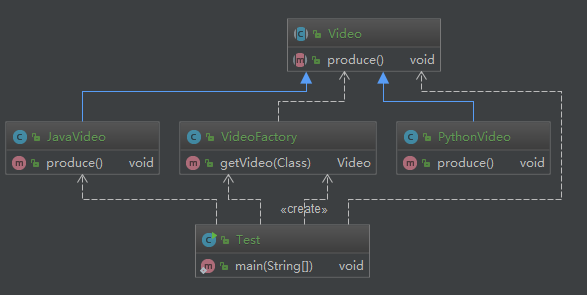
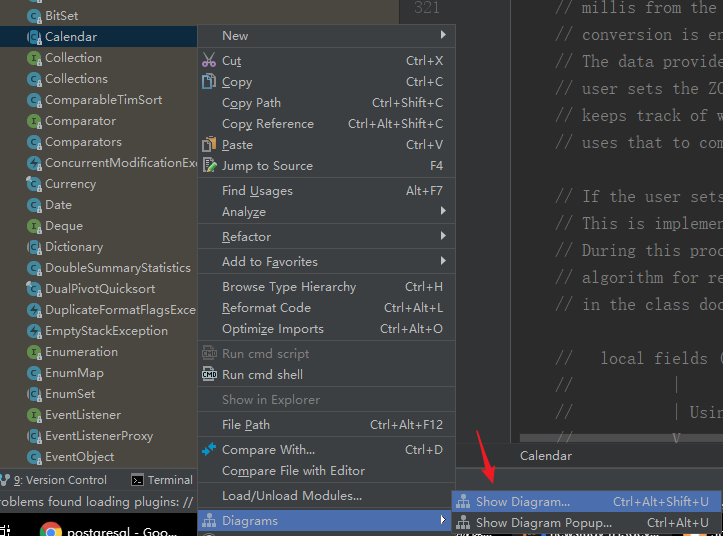
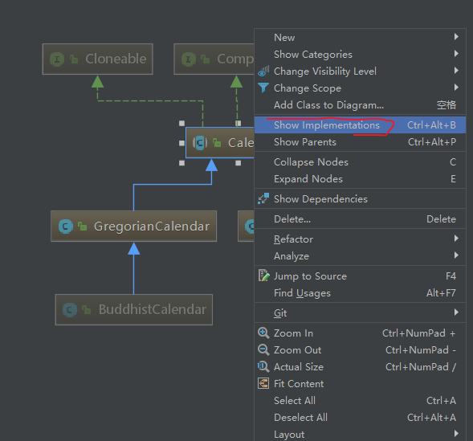

# 简单工厂

> 关联阅读 [李兴华-简单工厂](/chapter/design_pattern/简单工厂.md)

**定义**：由一个工厂对象决定创建出哪一种产品类的实例

**类型**：创建型，但不属于 GOF23 种设计模式

抽象工厂和工厂方法模式是由简单工厂一步一步进化的


## 适用场景

* 工厂类负责创建的对象比较少
* 客户端（应用层）只知道传入工厂类的参数，对于如何创建对象（逻辑）不关心

## 优点

* 只需要传入一个正确的参数，就可以获取你所需要的对象
* 无须知道其创建细节

## 缺点

* 职责相对过重

  增加新的产品，需要修改工厂类的判断逻辑，违背开闭原则
## coding

> https://en.wikipedia.org/wiki/Design_Patterns#Patterns_by_Type

Creational 中是没有简单工厂模式的。所以不属于 GOF23 种设计模式

场景：生成课程视频，不同的课程生成的视频逻辑不一样

## 不用模式
```java
public abstract class Video {
    public abstract void produce();
}

public class JavaVideo extends Video {
    @Override
    public void produce() {
        System.out.println("录制 Java 课程");
    }
}

public class PythonVideo extends Video {
    @Override
    public void produce() {
        System.out.println("录制 Python 课程");
    }
}

public class Test {
    public static void main(String[] args) {
        Video video = new JavaVideo();
        video.produce();
    }
}
```



目前这个客户端（Test）需要依赖具体的实现类，那么能否让应用层不依赖具体的实现类呢？（很多时候基本上不会去用子类的特有方法）

## 使用简单工厂改造

```java
public class VideoFactory {
    public Video getVideo(String type) {
        if ("java".equalsIgnoreCase(type)) {
            return new JavaVideo();
        } else if ("python".equalsIgnoreCase(type)) {
            return new PythonVideo();
        }
        return null;
    }
}
```

客户端则不需要依赖具体的实现类，直接和简单工厂交互，得到 Video 实例即可

```java
public class Test {
    public static void main(String[] args) {
//        Video video = new JavaVideo();
//        video.produce();
        VideoFactory factory = new VideoFactory();
        Video video = factory.getVideo("java");
        video.produce();
    }
}
```




新增课程的时候，还是需要修改工厂类的判定。我们追求的是对扩展开放，对修改关闭，那么就可以使用工厂方法来演进一下，到时候再对比下简单工厂

这里还可以使用反射里弥补下简单工厂的扩展性

## 使用反射演进简单工厂

```java
public class VideoFactory {
    public Video getVideo(Class c) {
        String name = c.getName();
        Video video = null;
        try {
            video = (Video) Class.forName(name).newInstance();
        } catch (ClassNotFoundException e) {
            e.printStackTrace();
        } catch (IllegalAccessException e) {
            e.printStackTrace();
        } catch (InstantiationException e) {
            e.printStackTrace();
        }
        return video;
    }
}

public class Test {
    public static void main(String[] args) {
        VideoFactory factory = new VideoFactory();
        Video video = factory.getVideo(JavaVideo.class);
        video.produce();
    }
}
```


这个改进在一定成都上满足了开闭原则，对于新增课程，工厂类不需要修改，但是 客户端又依赖了具体的实现类。

所以说，设计模式和设计原则只能是适度，并且结合当前的业务模型，做一个权衡的取舍，没有固定的好方式

## jdk 中部分类使用简单工厂的源码

```java
java.util.Calendar

Calendar.getInstance() 获取日历对象的实例就是一个简单工厂

public static Calendar getInstance()
{
    return createCalendar(TimeZone.getDefault(), Locale.getDefault(Locale.Category.FORMAT));
}

private static Calendar createCalendar(TimeZone zone,
                                       Locale aLocale)
{
    CalendarProvider provider =
        LocaleProviderAdapter.getAdapter(CalendarProvider.class, aLocale)
                             .getCalendarProvider();
    if (provider != null) {
        try {
            // 提供者，根据传入的时区和 地区 获取实例，这就是一个简单工厂的例子
            return provider.getInstance(zone, aLocale);
        } catch (IllegalArgumentException iae) {
            // fall back to the default instantiation
        }
    }
```

这里记录下，在idea中怎么看uml类图，之前是不会看



上图打开之后，默认只会显示 这一个类的父类，子类怎么显示呢?



### 日志框架

```java
org.slf4j.LoggerFactory#getLogger(java.lang.Class<?>)

public static Logger getLogger(String name) {
    ILoggerFactory iLoggerFactory = getILoggerFactory();
    // 也是根据名称返回实例
    return iLoggerFactory.getLogger(name);
}
```

## 源码的阅读

1. 可以通过上面类图的查看方式，了解一些主要类的情况
2. 可以通过设计模式来聚焦理解
